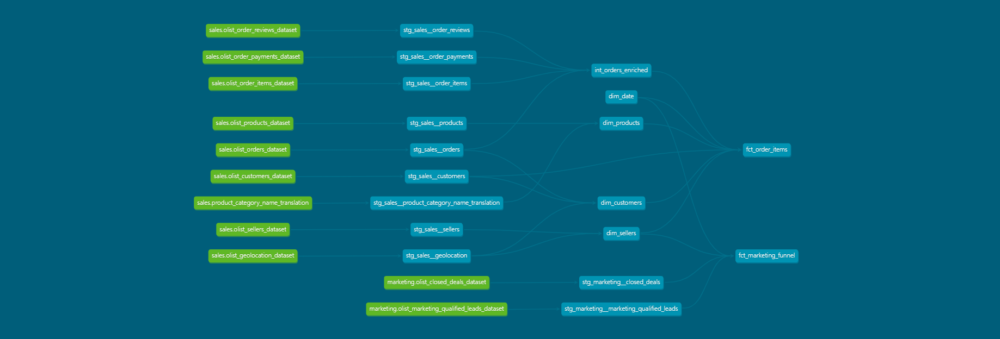

# dbt-Olist

End-to-end dbt pipeline built on Databricks using the Brazilian [Olist e-commerce dataset](https://www.kaggle.com/datasets/olistbr/brazilian-ecommerce). Covers raw ingestion through mart layer across two business domains — sales and marketing — with incremental models, SCD Type 2 snapshots, singular tests, and a GitHub Actions CI pipeline running against Databricks.

---

## Architecture



```
Seeds (CSV)
    ├── Sales domain
    │    └── Staging (stg_sales__*)
    │         └── Intermediate
    │              └── int_orders_enriched   ← orders + customers + payments joined
    │                   └── Marts
    │                        └── fct_order_items     (incremental, Delta)
    │
    └── Marketing domain
         └── Staging (stg_marketing__*)
              └── Marts
                   └── fct_marketing_funnel  (incremental, Delta)

Snapshots
    └── snapshot_sellers   (SCD Type 2 — check strategy)
```

No intermediate layer for marketing — only two source tables with a single join on `mql_id`. An intermediate model would add complexity with no reusable logic.

---

## What This Demonstrates

- **Incremental models** — `fct_order_items` uses a Jinja macro (`incremental_filter`) for the lookback window; `fct_marketing_funnel` uses an inline CTE watermark on `lead_original_date`
- **SCD Type 2 snapshot** — `snapshot_sellers` tracks changes to `seller_city`, `seller_state`, `seller_zip_code_prefix` using dbt's check strategy (no timestamp column required in source)
- **Two business domains** — sales and marketing modelled separately with isolated schemas, shared dims (`dim_date`) reused across domains per Kimball pattern
- **Full funnel modelling** — `fct_marketing_funnel` includes unconverted leads with nulls on deal columns to preserve drop-off visibility
- **Test coverage** — `not_null`, `unique`, `accepted_values`, relationship tests, and 6 singular tests
- **GitHub Actions CI** — `dbt build` runs on schedule against Databricks prod (`olist_prod_*` schemas); seeds only reload when CSVs change via git diff check
- **Schema separation** — dev and prod schemas fully isolated via `generate_schema_name` macro
- **dbt_utils** — `dbt_utils.star()` used in mart models

---

## Tech Stack

| Tool | Purpose |
|---|---|
| dbt-databricks | Transformation layer |
| Databricks | Compute + Delta Lake storage |
| Delta Lake | Incremental materializations |
| GitHub Actions | CI — automated dbt build on schedule |
| Python / venv | Local development |

---

## Schema Structure

| Schema | Contents |
|---|---|
| `olist_dev_raw` | Sales seeds (orders, customers, products, sellers, payments, reviews, order items) |
| `olist_dev_mkt_raw` | Marketing seeds (MQL, closed deals) |
| `olist_dev_stg` | Sales staging models |
| `olist_dev_mkt_stg` | Marketing staging models |
| `olist_dev_marts` | Sales intermediate + marts |
| `olist_dev_mkt_marts` | Marketing marts |

Prod schemas follow the same pattern with `olist_prod_*` prefix.

---

## Key Models

### fct_order_items
- **Grain:** one row per order line item
- **Incremental strategy:** merge on `order_item_key`, filtered via `incremental_filter` macro using max watermark on `order_purchase_timestamp`
- **Key columns:** `order_item_key`, `order_id`, `product_id`, `seller_id`, `customer_id`, `order_purchase_timestamp`, `price`, `freight_value`

### fct_marketing_funnel
- **Grain:** one row per marketing qualified lead (MQL)
- **Incremental strategy:** inline CTE watermark on `lead_original_date`
- **Includes unconverted leads** — leads with no closed deal have nulls on `deal_close_date`, `business_segment`, `declared_monthly_revenue` etc.
- **Key columns:** `mql_id`, `seller_id`, `lead_original_date`, `lead_original_date_key`, `lead_source`, `deal_close_date`, `business_segment`, `lead_type`, `lead_behaviour_profile`, `business_type`, `declared_monthly_revenue`, `sales_rep_id`, `sales_manager_id`
- **Note:** `sales_rep_id` and `sales_manager_id` are deal attributes, not foreign keys — no relationship test, `not_null` only

### snapshot_sellers
- **Strategy:** check — fires when `seller_city`, `seller_state`, or `seller_zip_code_prefix` changes
- **Why check over timestamp:** source data has no reliable updated_at column on sellers
- **dbt columns added:** `dbt_scd_id`, `dbt_valid_from`, `dbt_valid_to`, `dbt_updated_at`

### int_orders_enriched
- Joins `stg_sales__orders`, `stg_sales__customers`, and `stg_sales__order_payments`
- Feeds `fct_order_items` — centralises order-level enrichment so mart logic stays clean

---

## How to Run

**Prerequisites:** Python venv, dbt-databricks installed, Databricks workspace access, `profiles.yml` in project root.

```bash
# Activate venv
C:\Projects\OLIST\dbt-env\Scripts\Activate.ps1

# Navigate to project
cd C:\Projects\OLIST\olist

# Run full build (dev)
dbt build --profiles-dir .

# Run full refresh on incremental models
dbt build --profiles-dir . --full-refresh

# Run specific model
dbt run --profiles-dir . --select fct_order_items

# Run marketing domain only
dbt build --profiles-dir . --select +fct_marketing_funnel

# Generate docs
dbt docs generate --profiles-dir .
dbt docs serve --profiles-dir .
```

---

## Key Decisions

- **Geolocation CSV trimmed** — lat/long columns dropped, only zip code, city, and state retained. 2M+ rows with coordinates unused in any mart model — keeping them added size with no analytical value.
- **Orphan products set to `severity: warn`** — 923 `product_id` values in `order_items` have no match in the products table. Genuine data quality issues in the source, not a pipeline bug. A hard failure would block CI on data we cannot fix.
- **Three orders with no payment records** — present in the source data. Excluded from `fct_order_items` via inner join rather than surfacing nulls in the mart.
- **Duplicate `review_id` values** — deduplicated in staging using `ROW_NUMBER()` partitioned by `review_id`, keeping the most recent record.
- **`incremental_filter` macro in sales, inline CTE in marketing** — macro used in `fct_order_items` because the watermark logic is reusable across sales models. `fct_marketing_funnel` uses an inline CTE because `lead_original_date` is specific to that model — a macro would be over-engineering for one use case.
- **No dim tables for marketing** — `fct_marketing_funnel` reuses `dim_date` from the sales domain. No new dims created because marketing doesn't own any new entities. `sales_rep_id` and `sales_manager_id` are deal attributes, not foreign keys to a rep dimension.
- **No intermediate layer for marketing** — two source tables, one join on `mql_id`. An intermediate model would add a file and a DAG node with no reusable logic.

---

## CI Pipeline

GitHub Actions runs `dbt build` on a schedule against `olist_prod_*` schemas on Databricks.

- Seeds only reload when the corresponding CSV file has changed (`git diff` check on the seeds directory)
- Current status: `PASS=121 WARN=1 ERROR=0`
- The single warning is the orphan `product_id` relationship test (intentional — see Key Decisions above)

---

## Dataset

[Olist Brazilian E-Commerce](https://www.kaggle.com/datasets/olistbr/brazilian-ecommerce) — 100k orders from 2016–2018 across Brazilian marketplaces. Two datasets:

- **Sales:** orders, customers, products, sellers, payments, reviews, order items, geolocation
- **Marketing:** marketing qualified leads (MQL) and closed deals — tracks the seller acquisition funnel from first contact to conversion
